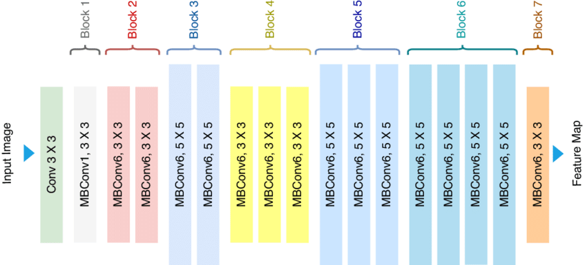

# Image Segmentation Model with PyTorch

This repository contains an image segmentation model implemented in PyTorch. The model uses EfficientNet-B0 as the encoder for feature extraction and is designed for semantic segmentation tasks.

## Model

The model is built using the EfficientNet-B0 encoder, which is known for its efficiency and accuracy. The architecture leverages the pre-trained weights of EfficientNet-B0 to improve segmentation performance.

## Encoder Architechture

## Results

